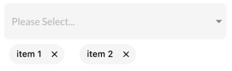

Intro
----
Flutter plugin use to show multiselect item dropdown.

Option
----
| option                      | Description                                              | type                             | required |
|-----------------------------|----------------------------------------------------------|----------------------------------|----------|
| list                        | The list of items                                        | List<T>?                         | true     |
| hintText                    | The placeholder displayed before the user choose an item | String?                          | false    |
| onSelectedItem              | Called when selected item in dropdown                    | Function(T)?                     | false    |
| initialValue                | Initial selected item                                    | T?                               | false    |
| hintTextStyle               | The text style of hint                                   | TextStyle?                       | false    |
| itemTextStyle               | The text style of item                                   | TextStyle?                       | false    |
| iconColor                   | The color of icon                                        | Color?                           | false    |
| backgroundDropdownColor     | The color of background                                  | Color?                           | false    |
| backgroundBorderRadiusColor | The color of background border radius                    | Color?                           | false    |
| backgroundChipColor         | The color of chip                                        | Color?                           | false    |
| backgroundChipTextColor     | The color of chip text                                   | Color?                           | false    |
| showBorderRadius            | Show border radius                                       | bool?                            | false    |
| isMultiSelected             | Enable multiple select item                              | bool?                            | false    |
| isShowMultiSelected         | Show multiple seleted item                               | bool?                            | false    |
| selectedList                | The list of selected item                                | List<T?>?                        | false    |
| onUpdateSelectedList        | Call when multiple selected item                         | Function(List<T?> selectedList)? | false    |
| stringBuilder               | Custom displayed text of item                            | Function(T item)?                | false    |

Usages and Example
----
Default Dropdown


```
MultiSelectedItemDropdown<String>(
              list: ['item 1', 'item 2', 'item 3', 'item 4'], //required field
              hint: 'Please Select...',
              onSelectedItem: (String selectedValue) {
               print(selectedValue);
              },
            );
```

Multiple Select Dropdown


```
return MultiSelectedItemDropdown<String>(
              list: ['item 1', 'item 2', 'item 3', 'item 4'],  //required field
              hint: 'Please Select...',
              selectedList: ['item 1', 'item 2'],
              isShowMultiSelected: true,
              isMultiSelected: true,
              onUpdateSelectedList: (List<String> selectedList) {
                 print(selectedList);
              },
            );
```